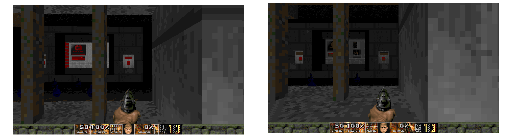

# Depth of water bug in SmoothDoom.pk3 (v. update 14.4.2020)

There's a minor bug in the Smooth Doom mod, update 14.4.2020[1]. The bug affects player's height in liquids, such as water. Obviously, this is meant as an effect, to simulate deep water, but this effect is not ordinarily present in original Doom (there's deep water e.g. in TNT's map 02, done with cleverly exploiting flat bleeding[2]). This might not be noticeable, or even regarded as a bug otherwise, but in Scythe 2's map 16 (Mr. X) you begin in a blood filled room and are supposed to fire a single shot a a switch. Due to the bug you are too short to hit the switch:



These kinds of situations, of course, occur rarely, but if there are similar situations in other maps, they should also be affected by this bug. At least this could be of interest to people who want to retain as original feel to Doom as possible... while using modern source port like GzDoom... well, anyway. 

## Easy hack to fix this behaviour

The source of this behaviour seems to be the file called TERRAIN inside SmoothDoom.pk3. This file defines the behvaviour of, well, terrain. For example:

```
terrain	water
{
 splash 	water
 footclip	 6
 liquid
}
```

The problematic part is the property called footclip. The mimic original Doom, these should all be set to zero. 

I am not sure if this'll break the expected behaviour of liquids in Heretic, Hexen or other games that use SmoothDoom.

## Sources

[1] https://www.doomworld.com/forum/topic/69451-smooth-doom-update-41420/
[2] https://doomwiki.org/wiki/Making_deep_water
